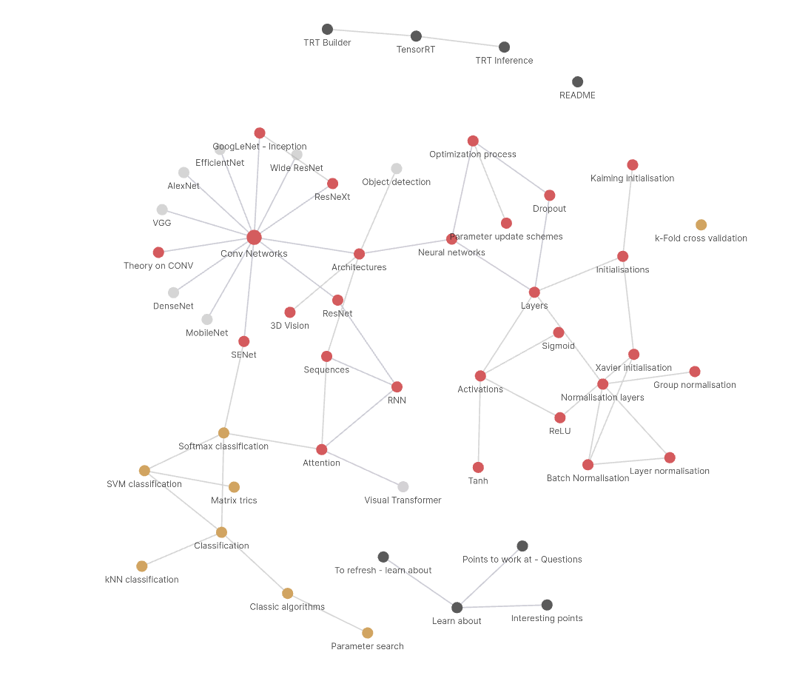

### The Goal
In this repo, I will track my knowledge in the domain of **Machine Learning** (more precisely **Computer Vision**) with the use of **Obsidian**

### Current knowledge graph

* With **Obsidian** you can **easily** visualize your knowledge nodes, see their connections and **fastly** search for required information.

### How to
To get the best from these notes:
1. Go to **[obsidian site](https://obsidian.md/download)** and install it
2. Clone my repo and enjoy!

